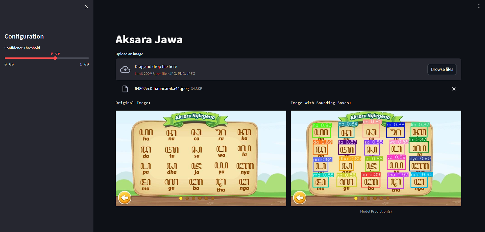

# YOLOv5 Aksara Jawa Object Detection

This is a Project to detect the Aksara Jawa from image.



## Features

- Upload an image for object detection.
- Adjust the confidence threshold for object detection.

## Installation

1. Clone this repository to your local machine:

   ```bash
   git clone https://github.com/hermansh-id/aksarayolov5.git
   cd aksarayolov5
   ```

2. Install the required packages using pip:

    ```bash
    pip install -r requirements.txt
    ```

3. Run the Streamlit app:

    ```bash
    cd src
    streamlit run simulation.py
    ```

## Configuration
The app uses a config.ini file for configuration. Update the config.ini file to specify the model path, device, and output folder.

```ini
[YOLOv5]
model_path = path/to/your/model.pt
device = cpu
output = output_folder/
```

## Usage
Launch the app using the command provided in the installation steps.
Adjust the confidence threshold using the sidebar slider.
Upload an image using the file uploader.
The app will display the original image and the image with bounding boxes.
Images processed by the app will be saved in the output folder.

## TO-DO
1. Make training script.
2. Upload dataset

## Contributing
Contributions are welcome! If you find any issues or have improvements, feel free to create a pull request.

## License
This project is licensed under the MIT License.